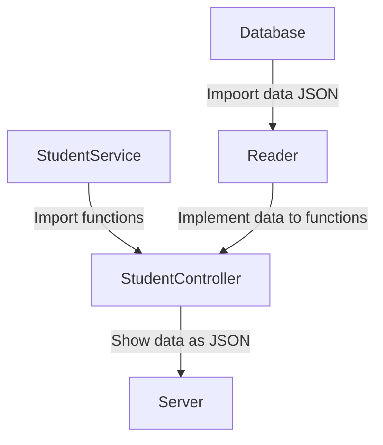

# 
 Curso de Visual Thinking API - Code Challenge 🚀

Este proyecto consiste en una aplicación web que permite visualizar los datos de una base de datos en formato JSON.

## Requerimentos del Code Challenge

1. Habilitar un endpoint para consultar todos los estudiantes con todos sus campos.
2. Habilitar un endpoint para consultar los emails de todos los estudiantes que tengan certificación.
3. Habilitar un endpoint para consultar todos los estudiantes que tengan mayor a 500.

## Dependencias:

Para este proyecto se utilizaron las siguientes dependencias:
- [Jest](https://jestjs.io/) 
- [Express](https://expressjs.com/)
- [ESLint](https://eslint.org/)

Empezando por jest, la utilicé para realizar las pruebas unitarias.
Después de esto, utilicé Express para crear el servidor y así poner en funcionamiento los endpoints requeridos.
Para finalizar, utilicé el eslint para realizar las pruebas de estilo. se utilizaron las siguientes herram

## Componentes: 

Implementé 3 funciones: 

`getAllStudents`, `getStudentsByCertification` y `getStudentsWithCreditsOver500`.
Cada una fue creada en StudentService, con el parametro de la ruta, en cada función se realizaron los procesos necesarios a partir de llamar el archivo JSON con la funcion `ReadJSONFile` de la clase Reader.

Luego de crear dichas funciones, fueron usadas en el controlador StudentController para realizar las peticiones a los endpoints.

Con eso creado, los endpoints fueron implementados en el servidor.

## Funcionamiento:
Instalar dependencias: `npm install`
Correr pruebas unitarias: `npm run test`
Para correr el servidor `npm run serve`

| Endpoint | Request | Response |
|---|---|---|
| `localhost:3000/students` |`localhost:3000/students` | All data students |
| `localhost:3000/students/certification` |`localhost:3000/students/certification` | Email of students with certification |
| `localhost:3000/students/credits` | `localhost:3000/students/credits` | Name of students with credits over 500 |

## Demostración:
`localhost:3000/students`

`localhost:3000/students/certification`

`localhost:3000/students/credits`

