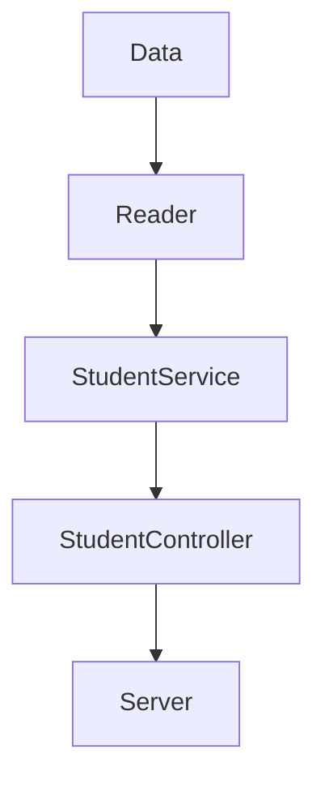
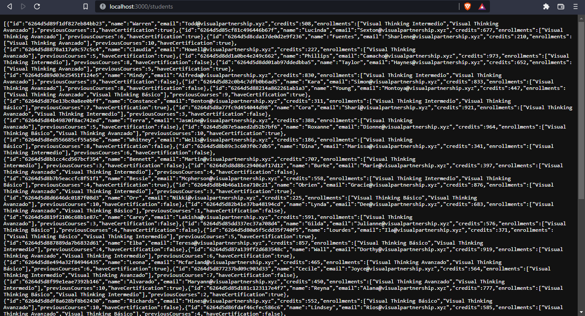
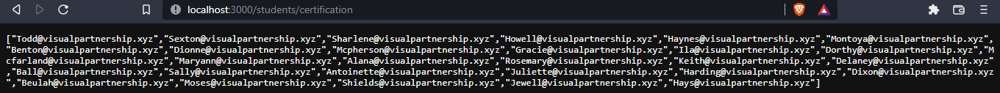
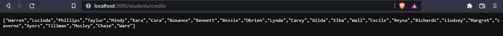

# 
 Curso de Visual Thinking API - Code Challenge 🚀

## Dependencias:

- [Jest](https://jestjs.io/) 
- [Express](https://expressjs.com/)
- [ESLint](https://eslint.org/)

Empezando por jest, la utilicé para realizar las pruebas unitarias.
Después de esto, utilicé Express para crear el servidor y así poner en funcionamiento los endpoints requeridos.
Para finalizar, utilicé el eslint para realizar las pruebas de estilo.

## Componentes: 

Implementé 3 funciones: 

`getAllStudents`, `getStudentsByCertification` y `getStudentsWithCreditsOver500`.
Cada una fue creada en StudentService, con el parametro de la ruta, en cada función se realizaron los procesos necesarios a partir de llamar el archivo JSON con la funcion `ReadJSONFile` de la clase Reader.

Luego de crear dichas funciones, fueron usadas en el controlador StudentController para realizar las peticiones a los endpoints.

Con eso creado, los endpoints fueron implementados en el servidor.

## Funcionamiento:

To run the server `npm run serve`

| Endpoint | Request | Response |
|---|---|---|
| `localhost:3000/students` |`localhost:3000/students` | All data students |
| `localhost:3000/students/certification` |`localhost:3000/students/certification` | Email of students with certification |
| `localhost:3000/students/credits` | `localhost:3000/students/credits` | Name of students with credits over 500 |

## Demostración:

